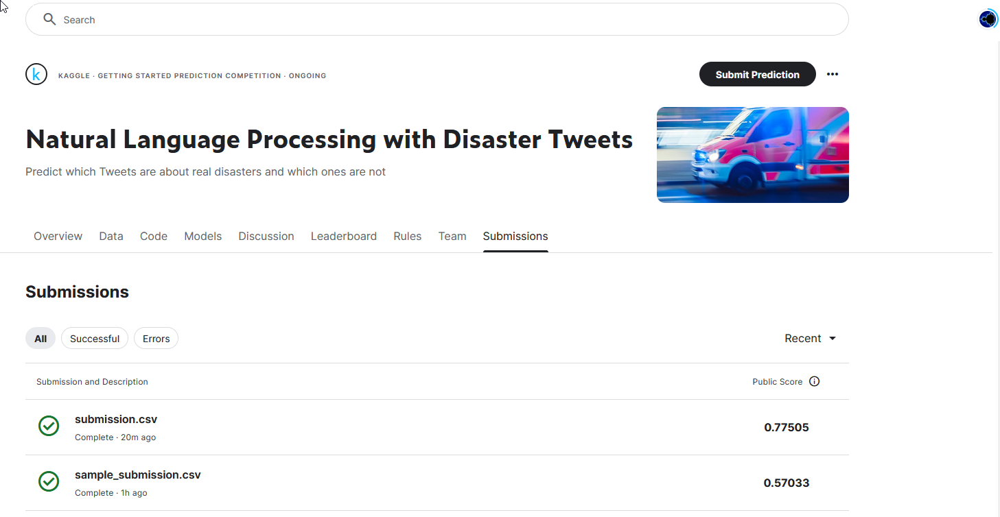

# Disaster Tweets Classification

This repository contains the solution for the Kaggle competition [Natural Language Processing with Disaster Tweets](https://www.kaggle.com/competitions/nlp-getting-started). The goal is to classify tweets as real disasters (`1`) or not (`0`) using Natural Language Processing (NLP) techniques and a deep learning model. The solution uses a Bidirectional LSTM-based neural network with embedding layers and dropout for regularization. The model achieved an F1 score of **0.74**, which was optimized by fine-tuning the decision threshold.

---

## Final Score Visualization

---

